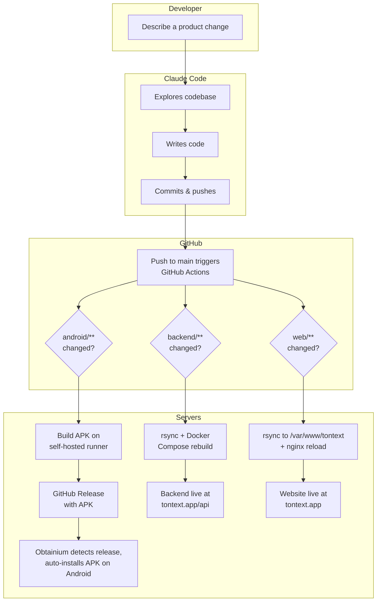

# Tontext

A privacy-focused Android voice keyboard. Press and hold the mic button, speak, release — your speech is transcribed locally on-device using [whisper.cpp](https://github.com/ggerganov/whisper.cpp). No internet required for transcription, no data leaves your phone.

Supports ~99 languages. The AI model (~57 MB) is downloaded once on first launch to keep the APK small (<10 MB).

## System Components

This is a mono-repo with four components:

| Component | Path | Tech | Purpose |
|-----------|------|------|---------|
| **Android App** | `android/` | Kotlin, C++ (JNI), whisper.cpp | The keyboard IME itself |
| **Backend** | `backend/` | Python, FastAPI, SQLite | Serves APK downloads, tracks stats, admin dashboard |
| **Website** | `web/` | Vanilla HTML/CSS | Landing page at [tontext.app](https://tontext.app) |
| **Infrastructure** | `deploy/`, `infra/`, `.github/workflows/` | Docker, Nginx, GitHub Actions | Deployment configs and CI/CD |

## Development Workflow

Development is fully AI-assisted using [Claude Code](https://claude.com/claude-code). There are no manual code edits — all changes are made by describing what you want in natural language.

### The Development Cycle



### Step by Step

1. **Request a change** — Describe what you want in Claude Code (e.g. "add a settings button to the keyboard", "make the waveform bars thicker")
2. **Claude Code implements** — It reads the codebase, makes changes across any component, and creates atomic git commits
3. **Push to main** — Claude Code pushes to GitHub, which triggers CI/CD via path-based workflows:
   - `android/**` changed → APK build on the self-hosted runner → GitHub Release
   - `backend/**` or `deploy/**` changed → rsync to server → Docker rebuild → backend live
   - `web/**` changed → rsync to server → nginx reload → website live
4. **APK auto-updates** — [Obtainium](https://github.com/ImranR98/Obtainium) on the Android phone watches GitHub Releases, detects the new APK, and installs it automatically
5. **Test on device** — The updated keyboard is immediately available

### Infrastructure

| Server | Host | Role |
|--------|------|------|
| **Runner** | `89.58.28.241` (Netcup) | Self-hosted GitHub Actions runner with Android SDK/NDK, builds APKs |
| **Web** | `45.83.105.43` (Netcup) | Hosts backend (Docker), website (static), nginx reverse proxy with SSL |

### Prerequisites for Contributing

- A local checkout of this repo (with `--recursive` for the whisper.cpp submodule)
- [Claude Code](https://claude.com/claude-code) CLI installed
- That's it — Claude Code handles the rest

```bash
git clone --recursive https://github.com/inaplay/tontext-android.git
cd tontext-android
claude
```

## Project Documentation

- **`PLAN.md`** — Full product specification and implementation phases
- **`UI_STATES.md`** — UI state diagrams and wireframes
