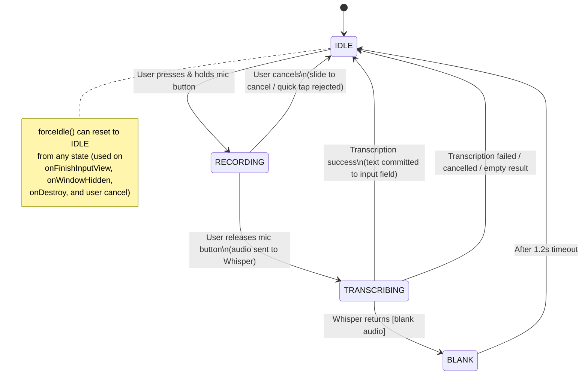

# TonText IME State Machine

The `TonTextIMEService` manages keyboard lifecycle through a strict state machine with validated transitions.

## States

| State | Description |
|-------|-------------|
| **IDLE** | Default state. Keyboard is ready, mic button enabled. No recording or transcription in progress. |
| **RECORDING** | User is holding the mic button. Audio is being captured and the waveform + pulse circle visualize amplitude in real-time. |
| **TRANSCRIBING** | Recording has stopped. Audio is being sent to the Whisper model for speech-to-text conversion. A "Transcribing..." indicator is shown. |
| **BLANK** | Whisper returned `[blank audio]` (no speech detected). A brief "[Blank audio]" message is shown for 1.2 seconds before returning to IDLE. |

## State Diagram

## Allowed Transitions Table

| From | To | Trigger |
|------|----|---------|
| IDLE | RECORDING | `startRecording()` - user press-and-hold on mic |
| RECORDING | TRANSCRIBING | `stopRecordingAndTranscribe()` - user releases mic |
| RECORDING | IDLE | `cancelTranscription()` / `forceIdle()` - user cancels or keyboard hidden |
| TRANSCRIBING | IDLE | Transcription completes (text committed), fails, is cancelled, or returns empty |
| TRANSCRIBING | BLANK | Whisper returns `[blank audio]` or `[blank_audio]` |
| BLANK | IDLE | Automatic after 1200ms timeout |

## Force Reset

`forceIdle()` can transition from **any** state back to IDLE. It is called on:
- `onFinishInputView()` - input view is being dismissed
- `onWindowHidden()` - keyboard window hidden
- `onDestroy()` - service destroyed
- `cancelTranscription()` - user-initiated cancel

It cleans up resources for the current state (stops recorder, cancels transcription job, removes pending handler callbacks) before resetting.
