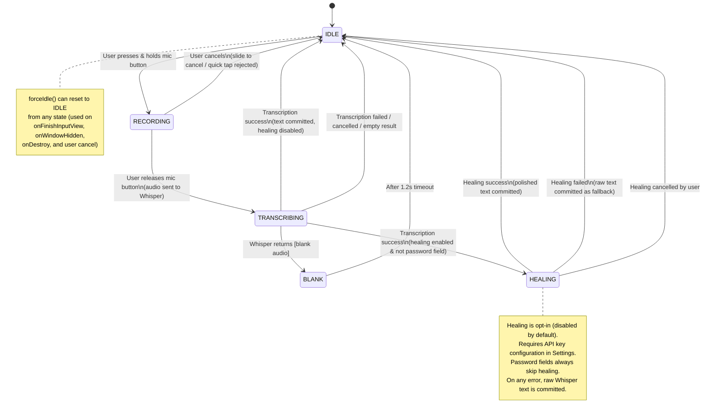

# TonText IME State Machine

The `TonTextIMEService` manages keyboard lifecycle through a strict state machine with validated transitions.

## States

| State | Description |
|-------|-------------|
| **IDLE** | Default state. Keyboard is ready, mic button enabled. No recording or transcription in progress. |
| **RECORDING** | User is holding the mic button. Audio is being captured and the waveform + pulse circle visualize amplitude in real-time. |
| **TRANSCRIBING** | Recording has stopped. Audio is being sent to the Whisper model for speech-to-text conversion. A "Transcribing..." indicator is shown. |
| **BLANK** | Whisper returned `[blank audio]` (no speech detected). A brief "No speech detected" message is shown for 1.2 seconds before returning to IDLE. |
| **HEALING** | Transcription succeeded and text polishing is enabled. The raw Whisper text is being sent to an LLM for context-aware correction. A "Polishing..." indicator is shown in accent color. |

## State Diagram

## Allowed Transitions Table

| From | To | Trigger |
|------|----|---------|
| IDLE | RECORDING | `startRecording()` - user press-and-hold on mic |
| RECORDING | TRANSCRIBING | `stopRecordingAndTranscribe()` - user releases mic |
| RECORDING | IDLE | `cancelTranscription()` / `forceIdle()` - user cancels or keyboard hidden |
| TRANSCRIBING | IDLE | Transcription completes (text committed, healing disabled), fails, is cancelled, or returns empty |
| TRANSCRIBING | BLANK | Whisper returns `[blank audio]` or `[blank_audio]` |
| TRANSCRIBING | HEALING | Transcription succeeds, healing is configured, and field is not a password |
| HEALING | IDLE | LLM returns corrected text (committed), fails (raw text committed as fallback), or is cancelled |
| BLANK | IDLE | Automatic after 1200ms timeout |

## Force Reset

`forceIdle()` can transition from **any** state back to IDLE. It is called on:
- `onFinishInputView()` - input view is being dismissed
- `onWindowHidden()` - keyboard window hidden
- `onDestroy()` - service destroyed
- `cancelTranscription()` - user-initiated cancel

It cleans up resources for the current state (stops recorder, cancels transcription job, cancels healing job, removes pending handler callbacks) before resetting.

## Healing (Text Polishing)

When enabled in Settings, the healing step:
1. Captures the active app and field type via `onStartInput(EditorInfo)`
2. Builds a context-aware system prompt (e.g., casual for WhatsApp, formal for email)
3. Sends the raw Whisper transcription to an LLM (Anthropic Claude or OpenAI GPT)
4. Commits the polished text to the input field

**Safety**: Password fields are never sent to the LLM. On any error (network, auth, timeout), the raw Whisper text is committed as fallback.
